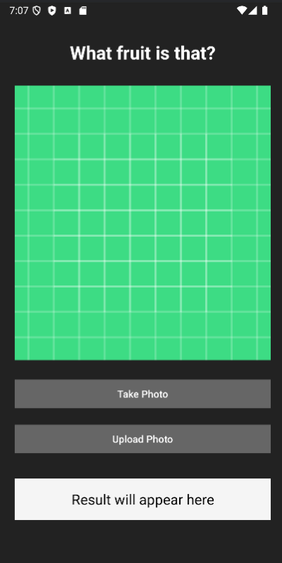

# Image-Recognition-App

This app is able to classify five different classes of fruit: apples, bananas, grapes, oranges, and strawberries. The user can choose to take a picture in the app or upload an image from their camera roll. I built the image classification using TensorFlow, and the App using Android and Kotlin. I collected the training images using a short web-crawling script I built in Python with the iCrawler library.

Model Training Colab:   
Web Crawler Colab:    
Demo Video: <a href = "https://github.com/Juliatduffy/Image-Recognition-App/blob/main/classifier-demo-vid.mp4">Classifier-demo-vid.mp4</a>

---

## Technology Used
* TensorFlow / TensorFlow Lite
* Kotlin + Android SDK 
* Google Colab
* iCrawler
* Android CameraX
* Android Permissions

---

## Screenshots

---

## Sources

https://www.tensorflow.org/tutorials/images/classification
https://github.com/hellock/icrawler

---

## Author

Created by Julia Duffy for personal use
