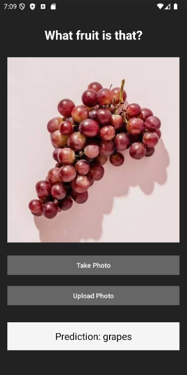

# Image-Recognition-App

This app is able to classify five different classes of fruit: apples, bananas, grapes, oranges, and strawberries. The user can choose to take a picture in the app or upload an image from their camera roll. I built the image classification using TensorFlow, and the App using Android and Kotlin. I collected the training images using a short web-crawling script I built in Python.

Image Classification Colab: https://colab.research.google.com/drive/1xNfVM-Js5YFXc4p4hvL2spomfsf1jnr4#scrollTo=5pxU_sTqNrZy  
Web Crawler Colab: https://colab.research.google.com/drive/1BJhcCzs0V1_9vaV_vfBbnocteg6c0m5t#scrollTo=jarxKflThSDS  
Demo Video: _Fill in Later_

---

## Features

---

## Screenshots

---

## Technologies Used

_Fill in later_

---

## Sources

https://www.tensorflow.org/tutorials/images/classification
https://github.com/hellock/icrawler

---

## Author

Created by Julia Duffy for personal use
